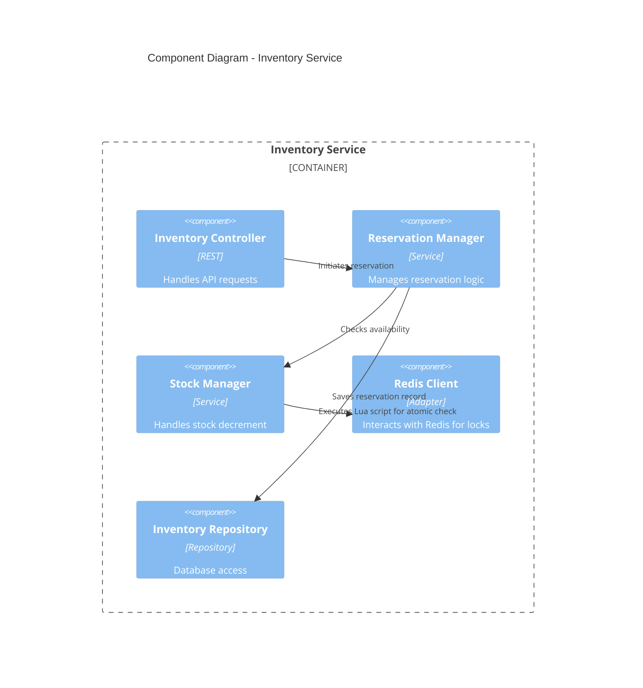

```mermaid
C4Component
    title Component Diagram - Inventory Service
    Container_Boundary(inv_service, "Inventory Service") {
        Component(inv_controller, "Inventory Controller", "REST", "Handles API requests")
        Component(reservation_mgr, "Reservation Manager", "Service", "Manages reservation logic")
        Component(stock_mgr, "Stock Manager", "Service", "Handles stock decrement")
        Component(redis_client, "Redis Client", "Adapter", "Interacts with Redis for locks")
        Component(db_repo, "Inventory Repository", "Repository", "Database access")
    }

    Rel(inv_controller, reservation_mgr, "Initiates reservation")
    Rel(reservation_mgr, stock_mgr, "Checks availability")
    Rel(stock_mgr, redis_client, "Executes Lua script for atomic check")
    Rel(reservation_mgr, db_repo, "Saves reservation record")
```
