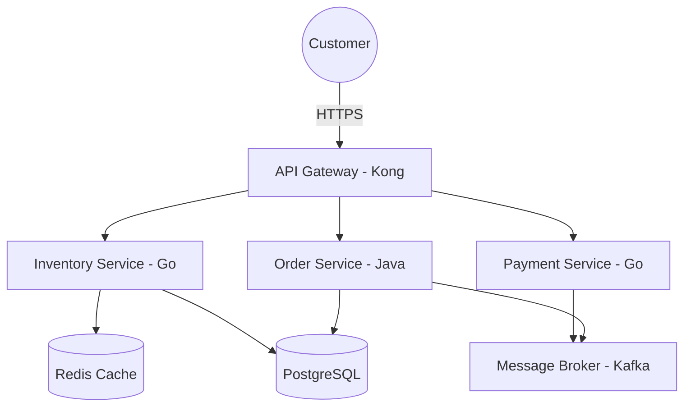

```mermaid
graph TD
    Customer((Customer)) -->|HTTPS| API[API Gateway - Kong]
    API --> Inv[Inventory Service - Go]
    API --> Ord[Order Service - Java]
    API --> Pay[Payment Service - Go]
    
    Inv --> Redis[(Redis Cache)]
    Inv --> DB[(PostgreSQL)]
    
    Pay --> Kafka[Message Broker - Kafka]
    Ord --> Kafka
    Ord --> DB
```
