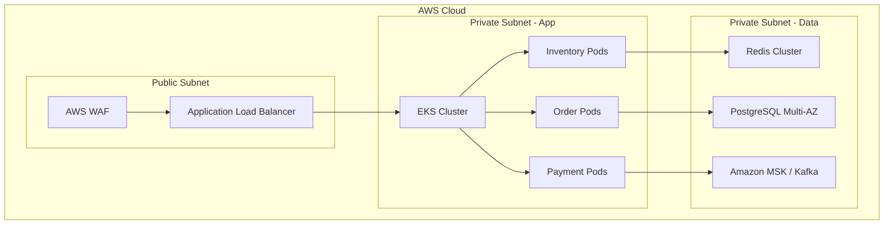

```mermaid
graph TD
    subgraph AWS Cloud
        subgraph Public Subnet
            WAF[AWS WAF] --> ALB[Application Load Balancer]
        end
        subgraph Private Subnet - App
            ALB --> EKS[EKS Cluster]
            EKS --> Pod1[Inventory Pods]
            EKS --> Pod2[Order Pods]
            EKS --> Pod3[Payment Pods]
        end
        subgraph Private Subnet - Data
            Pod1 --> ElastiCache[Redis Cluster]
            Pod2 --> RDS[PostgreSQL Multi-AZ]
            Pod3 --> MSK[Amazon MSK / Kafka]
        end
    end
```
