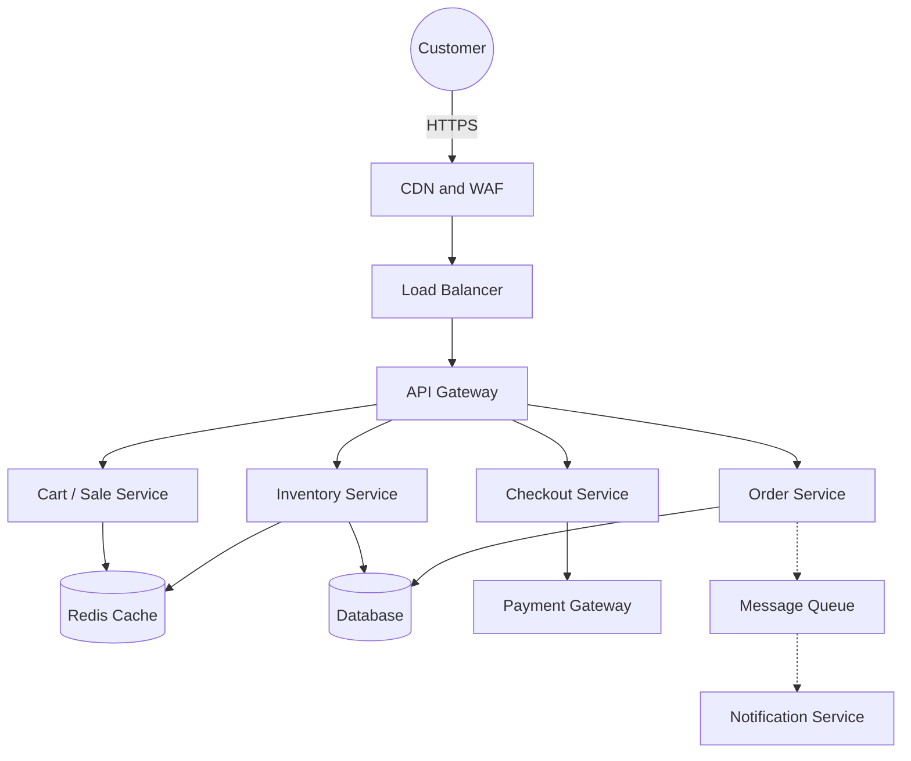

```mermaid
graph TD
    User((Customer)) -->|HTTPS| CDN[CDN and WAF]
    CDN --> LB[Load Balancer]
    LB --> API[API Gateway]
    
    API --> CartService[Cart / Sale Service]
    API --> InventoryService[Inventory Service]
    API --> CheckoutService[Checkout Service]
    API --> OrderService[Order Service]
    
    CartService --> RedisCache[(Redis Cache)]
    InventoryService --> RedisCache
    InventoryService --> DB[(Database)]
    CheckoutService --> PaymentGateway[Payment Gateway]
    OrderService --> DB
    OrderService -.-> NotificationQueue[Message Queue]
    NotificationQueue -.-> NotificationService[Notification Service]
```
