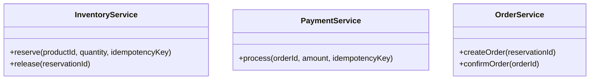

```mermaid
classDiagram
    class InventoryService {
        +reserve(productId, quantity, idempotencyKey)
        +release(reservationId)
    }
    class PaymentService {
        +process(orderId, amount, idempotencyKey)
    }
    class OrderService {
        +createOrder(reservationId)
        +confirmOrder(orderId)
    }
```
