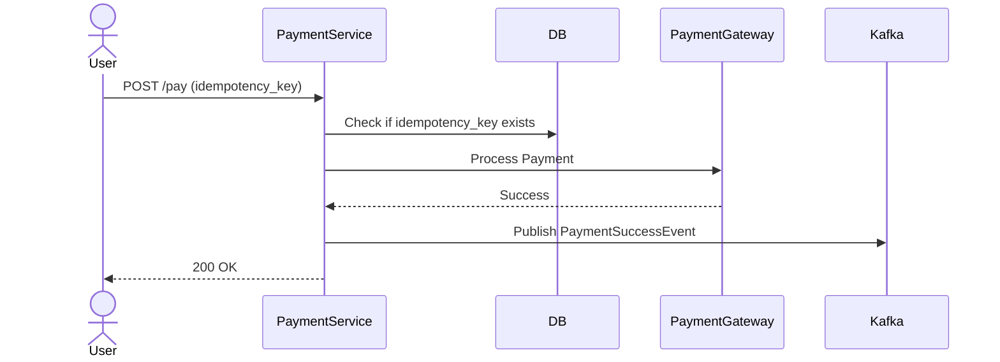

```mermaid
sequenceDiagram
    actor User
    User->>PaymentService: POST /pay (idempotency_key)
    PaymentService->>DB: Check if idempotency_key exists
    PaymentService->>PaymentGateway: Process Payment
    PaymentGateway-->>PaymentService: Success
    PaymentService->>Kafka: Publish PaymentSuccessEvent
    PaymentService-->>User: 200 OK
```
