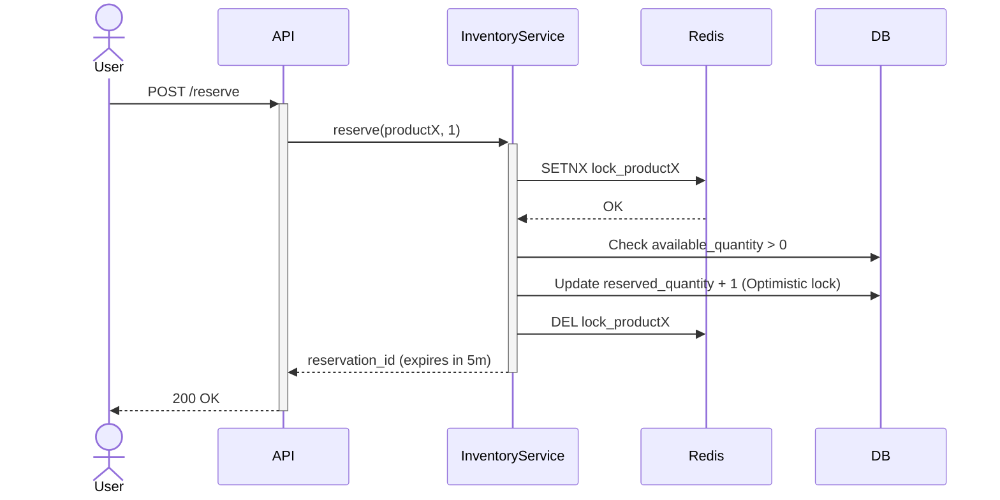

```mermaid
sequenceDiagram
    actor User
    User->>+API: POST /reserve
    API->>+InventoryService: reserve(productX, 1)
    InventoryService->>Redis: SETNX lock_productX
    Redis-->>InventoryService: OK
    InventoryService->>DB: Check available_quantity > 0
    InventoryService->>DB: Update reserved_quantity + 1 (Optimistic lock)
    InventoryService->>Redis: DEL lock_productX
    InventoryService-->>-API: reservation_id (expires in 5m)
    API-->>-User: 200 OK
```
