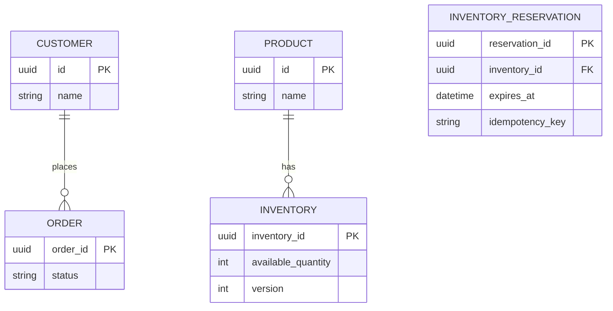

```mermaid
erDiagram
    CUSTOMER ||--o{ ORDER : places
    CUSTOMER {
        uuid id PK
        string name
    }
    PRODUCT ||--o{ INVENTORY : has
    PRODUCT {
        uuid id PK
        string name
    }
    INVENTORY {
        uuid inventory_id PK
        int available_quantity
        int version
    }
    INVENTORY_RESERVATION {
        uuid reservation_id PK
        uuid inventory_id FK
        datetime expires_at
        string idempotency_key
    }
    ORDER {
        uuid order_id PK
        string status
    }
```
